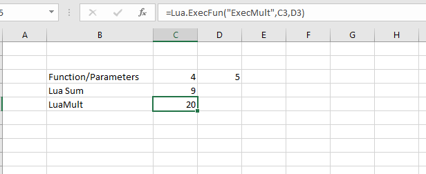

# XLL Add-in to execute Lua functions from withing Excel.

Like Excel? also like Lua? Add to Excel Lua scripting capabilities, with this XLL Ad-in, although a bit contrived, you can call  Lua functions from Excel.

## Requirements

* A 64-bit version of Excel ( Tested in Excel 2019)
* Visual Studio 2019
* The Excel SDK 2013
* Lua Lib (64 bits)

## Build  Instructions

- Get the Lua 64 bit library.
- In Visual Studio  configure Lua Library header .
- In Visual Studio  Linker configure Lua Library lib. 
- In Visual Studio  configure Excel 2013 SDK header .
- In Visual Studio  Linker configure Excel 2013 SDK Lib. 

## Plugin Usage Instructions

- Open Excel.

- Install plugin ExcelLuaXll.xll or double click ExcelLuaXll.xll.

- In the users home directory C:\Users\SomeUser place luascript.lua

- In Excel enter the Lua Formula: =Lua.ExecFun("**ExecMult**",C3,D3). The first parameter is the Lua function (see Lua script bellow), the other two are the parameter sent from Excel to the Lua Script.

 
  

## Lua Script Example


```lua
function ExecSum(a, b)
   return a + b
end

function ExecMult(a, b)
   return a * b
end
```
